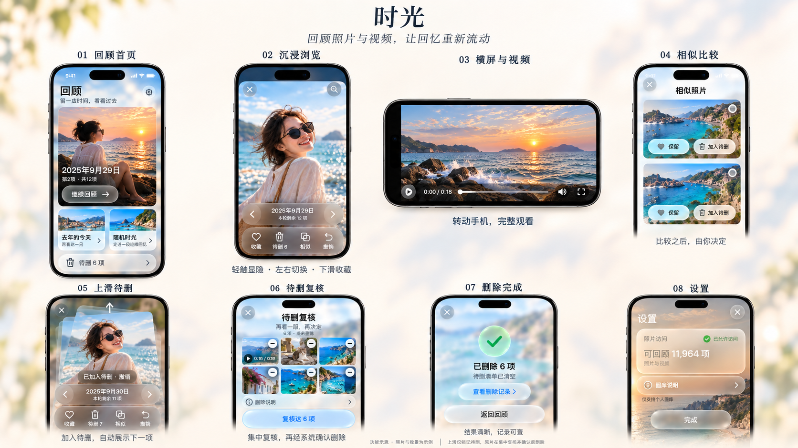
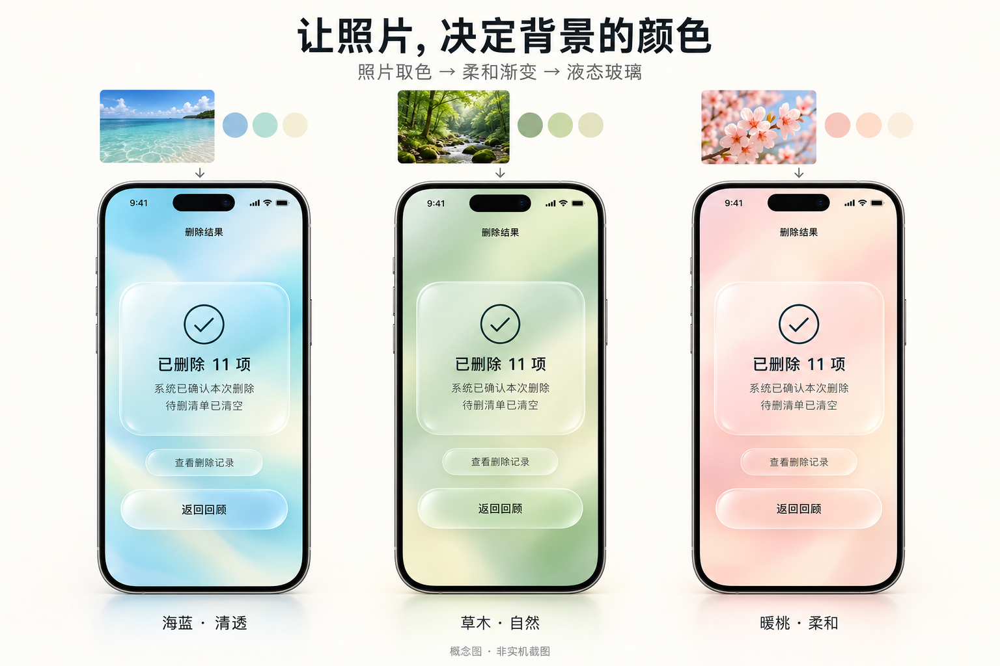
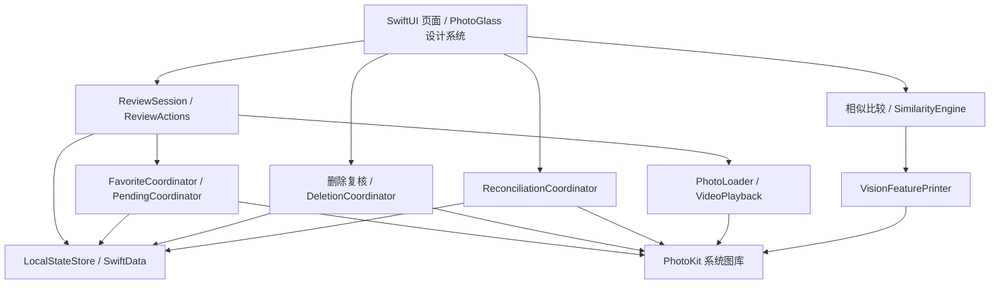

# LeafDay · 日叶

**留一点时间，看看过去。**

LeafDay 是一款 iPhone 照片与视频回顾应用：从一段连续时光开始，重新看看当时的人与事，顺手收藏喜欢的瞬间，把不需要的内容加入待删清单，最后集中复核。

照片越积越多，真正回看的机会却越来越少。这个项目希望让「打开相册看看过去」变得轻松：保留照片与视频的时间上下文，让整理自然发生在回顾之后。

> iPhone / iOS 26+ · Swift 6 · SwiftUI · PhotoKit · 本地状态与设备端相似分析
>
> 应用显示名为 **LeafDay**，首页中文名为 **日叶**。工程、Scheme 与源码目录沿用 `SwipeGo`。

## 设计与体验

首页的照片卡片、沉浸回顾、横屏视频和人工相似比较，是产品最核心的体验。下面的八屏概念稿展示整体流程；图片与数量均为示意，保留了早期名称和背景样式，并非当前版本的实机截图。



当前视觉采用 **照片取色 → 柔和渐变 → 原生 Liquid Glass**：信息页面从照片提取颜色，浏览页面保留清晰、完整比例的原媒体。无照片时使用中性渐变，减弱透明度时切换为实色卡片。



上图为 v8 视觉概念示意。已实现页面可见[原生截图与验证矩阵](docs/design/v8-native-verification.md)，包括[回顾首页](docs/design/v8-F009-v5-home-photo-cards.png)、[相似比较](docs/design/v8-F029-comparison-real.png)和[待删复核](docs/design/v8-F015-deletion-review.png)。这些截图使用测试素材，拍摄于品牌与计数调整之前；当前名称、计数和行为以代码及下文为准。另见 [LeafDay 品牌与图标](docs/design/leafday-brand.md)。

## 当前实现

截至 **2026-10-02**，F001–F017、F019–F035 已通过独立验收；F018 真机端到端与体验验证仍待完成。

| 能力 | 当前行为 |
| --- | --- |
| 连续时光回顾 | 继续上次、去年的今天、随机时光；照片与视频按时间排列，保存浏览位置，支持探索附近片段 |
| 随机片段预览 | 首页封面与即将打开的片段一致；从随机回顾返回后换一段预览 |
| 沉浸浏览 | 默认隐藏控件，轻触画面显隐；左右翻页，双指缩放，支持双向横屏与视频播放、进度、静音控制 |
| 收藏与待删 | 下滑收藏；上滑加入本地待删，保存成功后自动展示下一项；可撤销最近操作，收藏项标记前另行确认 |
| 相似照片比较 | 在有限时间范围内用设备端 Vision 寻找候选；用户逐张选择保留，收藏项固定保留，至少留一项 |
| 删除闭环 | 集中复核、冻结确认清单、系统确认删除、结果反馈与删除记录；相似分析与上滑本身不删除原片 |
| 状态恢复 | 会话与待删意图持久化；处理图库/权限变化；中断或结果未知的操作进入人工核对 |
| 原生视觉与辅助功能 | 照片取色渐变、Liquid Glass、动态字号、减弱透明度/动态效果与可访问性按钮 |

「剩余 N 项」指当前项之后、本轮尚可浏览且未标记待删的项目数，不包含当前项；最后一项显示 0，不代表已经完成本轮。

## 如何使用

1. 授权访问全部或部分照片，从首页选择继续回顾、去年的今天或随机时光。
2. 左滑看下一项，右滑看上一项；轻触照片或视频区域展开操作栏。也可通过按钮操作。
3. 下滑收藏喜欢的瞬间，上滑标记待删；需要仔细挑选时进入相似比较。
4. 回到首页打开待删清单，逐项复核、撤回不想删除的标记，再提交系统删除确认。

## 架构

这是一个原生 iOS 单体应用，没有自建后端。SwiftUI 负责界面，领域对象编排回顾和用户操作，基础设施适配系统图库、媒体、持久化与 Vision。



- **界面与操作分离**：`ReviewEntryView` 负责布局和动画；`ReviewActions` 统一协调待删、收藏、最近撤销与位置恢复；`ReviewSession` 管理稳定的片段顺序和游标。
- **系统图库是媒体事实来源**：原片、视频与收藏归 PhotoKit；SwiftData 保存会话、本地待删意图和操作记录，显式保存失败会向上反馈。
- **按需加载与有界分析**：照片缓存和邻近预取受限，视频离屏停止；异步结果绑定资产与请求代次，旧结果不能覆盖新画面。Vision 只分析有限候选，不自动扫描并删除全库。
- **删除需要独立确认**：先持久化操作记录，再请求系统变更；以系统回执判断结果。照片不可见不能被推断为删除成功，未知结果不会自动重试。

```text
SwipeGo/
├── App/                  # 应用入口、依赖组合与 Debug 测试入口
├── Features/             # 首页、回顾、比较、复核、权限和操作核对
├── Domain/               # 回顾会话、操作协调、相似分析与删除规则
├── Infrastructure/       # PhotoKit、媒体加载、SwiftData、Vision
├── DesignSystem/         # 照片取色、渐变与玻璃组件
└── Resources/            # 品牌图标与资源
SwipeGoTests/             # 领域与基础设施测试
SwipeGoUITests/           # 原生界面与系统交互测试
scripts/                  # 环境检查、素材生成与统一验证
Fixtures/                 # 可重建测试素材
.agent-harness/           # 需求、功能状态、工作流与验收记录
```

进一步的模型与历史演进见[架构文档](docs/architecture.md)；该文档保留早期规划及逐项实现记录，当前回顾操作边界以 `ReviewActions` 和上述结构为准。

## 本地启动

### 环境准备

需要 macOS、完整 Xcode（包含 **iOS 26+ SDK**）、一个可用的 **iOS 26+ iPhone 模拟器**、Python 3、XcodeGen **2.46+**，以及用于生成测试视频的 FFmpeg。没有远程 Swift Package，也不需要后端服务或 API Key。

通过 Homebrew 安装命令行依赖，然后在仓库根目录检查环境：

```bash
brew install xcodegen ffmpeg python
./scripts/doctor.sh
```

若 Xcode 或模拟器不符合要求，先在 Xcode 中安装对应组件并创建 iPhone 模拟器。`doctor.sh` 仅检查，不会创建或擦除设备。自定义 Xcode 位置可设置 `DEVELOPER_DIR`；指定已有模拟器可设置 `SWIPE_SIMULATOR_UDID`。

### 一条命令恢复并运行

```bash
./init.sh
```

该命令检查 Harness 与 Python 测试、验证工具链、生成测试素材和 Xcode 工程、恢复模拟器、验证 App 并安装启动。首次或证据失效时运行完整单元/UI 测试，因此需要等待；若最近 24 小时内存在完整且严格匹配的成功证据，可复用测试结果，但仍真实安装、启动 App。

默认只操作模拟器。验证会调整所选模拟器上的测试授权、使用生成素材测试系统删除，并可能重启该模拟器；请使用开发测试专用模拟器。不要同时在同一模拟器运行其他 Xcode 测试。

### 在 Xcode 中开发

完成上述恢复后：

```bash
open SwipeGo.xcodeproj
```

选择 **SwipeGo** Scheme 和 iPhone 模拟器，点击 Run。正常启动后在系统提示中授权照片访问；空图库会显示空态。可将可丢弃的照片/视频导入测试模拟器后体验回顾。

`project.yml` 是工程配置来源。修改配置后执行 `xcodegen generate --spec project.yml`，不要直接手改生成的工程。模拟器不需要开发者签名团队；真机需配置自己的签名团队、配对设备并启用开发者模式。

## 验证与开发协作

```bash
./verify.sh --changed                 # 工作区改动相关 UI 用例 + 全部单元测试
./verify.sh --changed --base <ref>    # 同时包含相对指定 Git ref 的已提交改动
./verify.sh --full                    # 强制执行完整回归
SWIPE_VERIFY_FRESH=1 ./init.sh         # 独立 Evaluator 的首次完整恢复验证
```

共享或无法归类的改动会回退完整验证。结果位于 `.build/verification/`：先看对应运行的 `summary.json` 或 `report.md`，再按需查看失败日志和截图。详见[验证说明](docs/verification.md)。

最近一次功能独立验收为 **F035：105 项单元测试 + 45 项 UI 测试通过，零失败、零跳过**，见[验收记录](.agent-harness/runs/20261002-F035-evaluation.md)。这是带日期的证据，不代表后续任意改动都已通过。

AI 协作从 [AGENTS.md](AGENTS.md) 开始，读取[当前进度](.agent-harness/progress.md)与[功能清单](.agent-harness/feature_list.json)。交互开发采用 `make -C .agent-harness work-fast`：当前会话实施，独立 Evaluator 验收；只对已明确授权的功能运行，不自动推进暂缓任务。

## 数据边界与当前限制

- 图片与视频经系统 PhotoKit 读取；相似分析在设备端执行，项目不接入云端模型或自建照片上传服务。iCloud 媒体仍可能由系统按需下载，不能理解为完全不联网。
- 本地会话、待删和操作记录使用 SwiftData，当前未启用 CloudKit 同步；不提供跨设备进度同步。
- 相似候选用于辅助人工判断，不是重复概率或画质推荐；Live Photo 当前按静态照片浏览。
- 已有真机安装和部分生成素材验证，但 **F018 尚未完成**：真实 iCloud、跨设备、较大图库性能与完整真机体验仍待补齐，模拟器通过不能替代这些证据。见[待完成设备验证](docs/deferred-device-verification.md)。
- 当前为本地开发版本；仓库不提供 App Store 或 TestFlight 安装入口。

需求范围以[产品规格](.agent-harness/SPEC.md)为准，完成状态以[功能清单](.agent-harness/feature_list.json)与对应独立验收记录为准。
