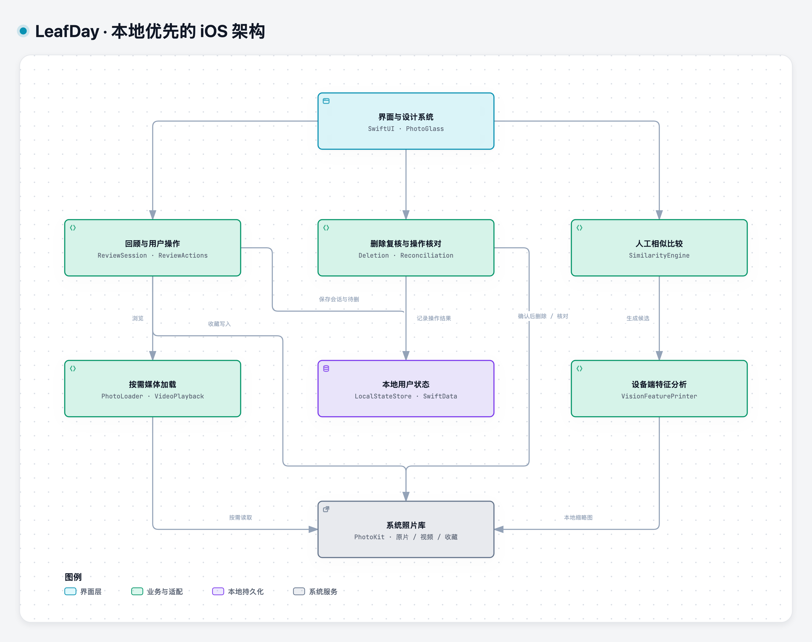

# LeafDay

**English** | [简体中文](README.zh-CN.md)

**Make a little time for your memories.**

LeafDay is a native iPhone app for revisiting photos and videos. Start with a continuous stretch of time, rediscover the people and moments in it, save your favorites, and set aside unwanted items for a separate deletion review.

Our photo libraries keep growing, but we rarely return to them. LeafDay makes looking back an easy habit: photos and videos stay in their chronological context, and tidying up follows naturally from the memories you revisit.

> iPhone / iOS 26+ · Swift 6 · SwiftUI · PhotoKit · Local state and on-device similarity analysis
>
> The app is named **LeafDay**, with **日叶** on its Chinese home screen. The Xcode project, scheme, and source directory retain the internal name `SwipeGo`.
>
> This English README is the primary version. A [Simplified Chinese translation](README.zh-CN.md) is available.

## Design and experience

Photo cards, immersive browsing, landscape video, and manual photo comparison are central to the experience. This eight-screen concept illustrates the overall flow. Images and counts are illustrative; it retains earlier branding and backgrounds and is **not a screenshot of the current app**.


The current visual direction follows **photo colors → soft gradients → native Liquid Glass**. Information screens take their palette from photos, while the viewer keeps the original media clear and at its full aspect ratio. A neutral gradient handles missing photos, and solid cards support Reduce Transparency.


The image above is a visual concept. See the [native screenshots and verification matrix](docs/design/v8-native-verification.md), including [home](docs/design/v8-F009-v5-home-photo-cards.png), [photo comparison](docs/design/v8-F029-comparison-real.png), and [deletion review](docs/design/v8-F015-deletion-review.png), for implemented screens. These use test media and predate the latest branding and counter changes; current behavior is described below. See also the [LeafDay brand and icon](docs/design/leafday-brand.md). UI images and most detailed project documents are currently in Chinese.

## What works today

As of **October 2, 2026**, F001–F017 and F019–F035 have passed independent evaluation. F018, the complete physical-device and experience validation, remains unfinished.

| Capability | Current behavior |
| --- | --- |
| Continuous memories | Resume a session, revisit this day last year, or open a random time segment; photos and videos stay in order, with a saved position and nearby segments to explore |
| Matching random previews | The home cover belongs to the segment that will open; returning from a random session selects another preview |
| Immersive viewing | Controls start hidden and toggle on tap; swipe navigation, pinch to zoom, both landscape orientations, and video playback, seeking, and mute controls |
| Favorites and pending deletion | Swipe down to favorite; swipe up to save a local deletion mark and advance; undo the latest action; marking a favorite requires confirmation |
| Similar-photo comparison | On-device Vision finds candidates within a bounded time window; choose what to keep, with favorites protected and at least one item retained |
| Reviewed deletion | Review pending items, freeze the confirmation list, request system deletion, and inspect results and history; swiping and similarity analysis never delete originals themselves |
| Recovery | Persist sessions and pending intent, handle library and permission changes, and reconcile interrupted or unknown operations |
| Native UI and accessibility | Photo-derived gradients, Liquid Glass, Dynamic Type, Reduce Transparency, Reduce Motion, and accessible button alternatives |

“Remaining N items” counts browsable, unmarked items **after the current item** in this session. It excludes the current item; reaching zero on the last item does not automatically complete the session.

## Using the app

1. Grant full or limited photo access, then resume a session, revisit this day last year, or choose a random segment.
2. Swipe left for the next item and right for the previous one. Tap the photo or video area to reveal controls; buttons provide alternatives to gestures.
3. Swipe down to favorite a moment or up to mark an item for deletion. Open similar-photo comparison when you want a closer look.
4. Return home to review the pending list, withdraw any marks you no longer want, and confirm deletion through the system prompt.

## Architecture

LeafDay is a native iOS monolith with no custom backend. SwiftUI renders the interface, domain objects coordinate sessions and user actions, and infrastructure adapters provide photo-library access, media loading, persistence, and Vision analysis.



[Vector diagram (SVG)](docs/design/leafday-architecture.svg) · [Editable Archify source](docs/design/leafday-architecture.archify.json)

- **Rendering and actions have separate owners.** `ReviewEntryView` owns layout and animation; `ReviewActions` coordinates pending marks, favorites, the latest undo, and position recovery; `ReviewSession` owns stable segment ordering and the cursor.
- **The system library is authoritative for media.** PhotoKit owns originals, videos, and favorites. SwiftData stores sessions, pending-deletion intent, and operation records, with explicit save failures propagated to callers.
- **Loading and analysis are bounded.** Photo caching and nearby prefetching have limits; video stops offscreen. Asynchronous results are tied to asset identity and request generation so stale results cannot replace the current view. Vision processes limited candidates rather than automatically scanning and deleting the entire library.
- **Deletion requires its own confirmation.** Persist the operation before requesting a system change, then interpret the system receipt. An invisible asset is not proof of deletion, and unknown results are never retried automatically.

```text
SwipeGo/
├── App/                  # Entry point, dependency composition, Debug test hosts
├── Features/             # Home, review, comparison, deletion, permissions, reconciliation
├── Domain/               # Sessions, action coordination, similarity and deletion rules
├── Infrastructure/       # PhotoKit, media loading, SwiftData, Vision
├── DesignSystem/         # Photo palettes, gradients, glass components
└── Resources/            # Brand icons and assets
SwipeGoTests/             # Domain and infrastructure tests
SwipeGoUITests/           # Native UI and system interaction tests
scripts/                  # Environment checks, fixtures, unified verification
Fixtures/                 # Reproducible test media
.agent-harness/           # Requirements, feature state, workflow, evaluation evidence
```

The [architecture document](docs/architecture.md) contains models and implementation history, including earlier plans. The current review-action boundary is reflected in `ReviewActions` and the overview above.

## Getting started

### Requirements

You need macOS, full Xcode with an **iOS 26+ SDK**, an available **iOS 26+ iPhone simulator**, Python 3, **XcodeGen 2.46+**, and FFmpeg for test video generation. There are no remote Swift Package dependencies, backend services, or API keys to configure.

Install command-line dependencies with Homebrew, then check the environment from the repository root:

```bash
brew install xcodegen ffmpeg python
./scripts/doctor.sh
```

If an SDK or simulator is missing, install the required components and create an iPhone simulator in Xcode. `doctor.sh` only inspects the environment; it does not create or erase devices. Set `DEVELOPER_DIR` for a custom Xcode location or `SWIPE_SIMULATOR_UDID` to select an existing simulator.

### Recover and run

```bash
./init.sh
```

This checks the harness and Python tests, validates the toolchain, generates fixtures and the Xcode project, recovers the simulator, verifies the app, and installs and launches it. The first run—or a run without valid matching evidence—executes the full unit/UI suite and takes time. Complete, strictly matching successful test evidence from the last 24 hours may be reused; installation and launch still run on the simulator.

The default mode uses a simulator only. Verification changes test photo permissions, exercises deletion with generated media, and may restart the selected simulator. Use a dedicated development simulator and avoid running another Xcode test session on it at the same time.

### Develop in Xcode

After recovery:

```bash
open SwipeGo.xcodeproj
```

Select the **SwipeGo** scheme and an iPhone simulator, then click Run. Grant photo access when prompted. An empty library shows an empty state; import disposable photos or videos into the test simulator to try a session.

`project.yml` is the source of truth for project configuration. After changing it, run `xcodegen generate --spec project.yml` rather than editing the generated project directly. Simulator development does not require a signing team. A physical device requires your own signing team, device pairing, and Developer Mode.

## Verification and development workflow

```bash
./verify.sh --changed                 # Relevant UI cases + all unit tests for working-tree changes
./verify.sh --changed --base <ref>    # Also include committed changes relative to a Git ref
./verify.sh --full                    # Force a complete regression run
SWIPE_VERIFY_FRESH=1 ./init.sh         # Independent evaluator's first full recovery run
```

Shared or unclassified changes fall back to full verification. Results are written under `.build/verification/`. Read the run's `summary.json` or `report.md` first, then inspect relevant failure logs and screenshots. See [verification details](docs/verification.md).

The latest feature evaluation, **F035**, passed **105 unit tests and 45 UI tests with no failures or skips**; see its [evaluation record](.agent-harness/runs/20261002-F035-evaluation.md). This is dated evidence, not a claim that every subsequent change has been tested.

For AI-assisted development, start with [AGENTS.md](AGENTS.md), [current progress](.agent-harness/progress.md), and the [feature list](.agent-harness/feature_list.json). Interactive implementation uses `make -C .agent-harness work-fast`: the active session implements a feature and a separate evaluator reviews it. Run this only for explicitly authorized features, without advancing deferred work automatically.

## Data boundaries and current limitations

- Photos and videos are accessed through PhotoKit; similarity analysis runs on-device. The project uses no cloud model or custom photo-upload service. The system may still download iCloud media on demand, so this is not a promise of zero network access.
- Sessions, pending marks, and operation records use SwiftData with CloudKit sync disabled. Cross-device progress sync is not implemented.
- Similarity candidates support human judgment; they are not duplicate probabilities or image-quality recommendations. Live Photos are currently viewed as still images.
- Physical-device installation and some generated-media checks have succeeded, but **F018 remains incomplete**. Real iCloud behavior, cross-device scenarios, larger-library performance, and the full device experience still need validation. Simulator results do not substitute for that evidence. See [deferred device verification](docs/deferred-device-verification.md).
- This is a local development version; the repository provides no App Store or TestFlight installation link.

The [product specification](.agent-harness/SPEC.md) defines scope. The [feature list](.agent-harness/feature_list.json) and independent evaluation records define completion status.
