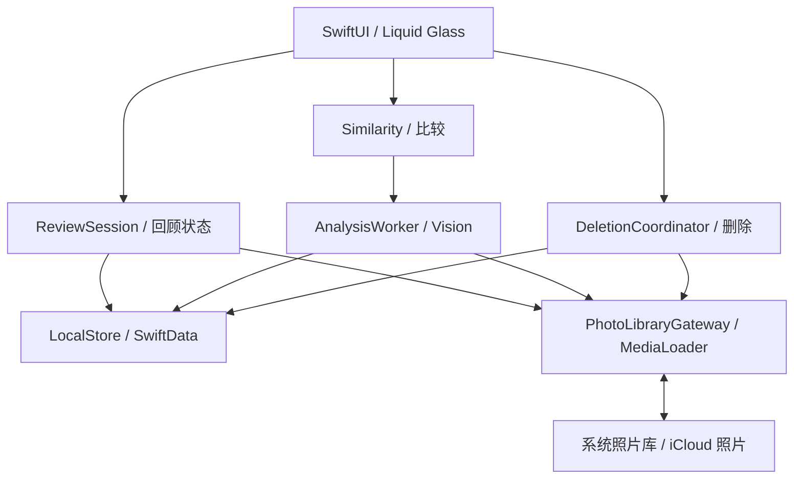
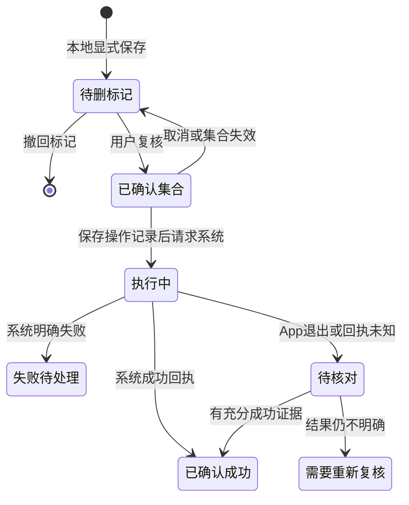

# Swipe-go 架构设计

状态：2026-09-26 规划基线；尚未实现。需求以 [SPEC](../.agent-harness/SPEC.md) 为准，建议细节见其 A01–A09。

## 选型与边界

iPhone / iOS 26+ 原生单体应用。SwiftUI + 原生 Liquid Glass；PhotoKit 访问图库；AVKit/AVFoundation 播放视频；SwiftData 保存本地状态；Vision 做设备端相似分析；Swift Concurrency 负责可取消任务与受控并发。必要时局部 UIKit 承载缩放/手势，先验证再决定。模块先以目录和接口分隔，无需微服务或多个 package。

## 模块职责

| 模块 | 职责与边界 |
|---|---|
| App / DesignSystem | 组合依赖、导航、玻璃按钮/工具栏/提示；不直接执行图库删除 |
| ReviewSession | 稳定资产顺序、游标、看过记录、手势意图；会话内不每次重新随机 |
| PhotoLibraryGateway | 授权、查询资产、收藏/删除系统请求、图库变化事件；统一处理 SDK 对象 |
| MediaLoader | 浏览尺寸、缓存、邻近预取、云端下载、取消、过期结果丢弃；不会复制全图库 |
| Similarity | 候选生成、特征/算法版本、组结果与建议理由；不拥有删除权限 |
| LocalStore | 显式持久化回顾、待删、操作记录；写失败向上报告，不假成功 |
| DeletionCoordinator | 固定确认集合、执行前校验、系统结果、崩溃后核对；唯一实际删除入口 |

UI 在 MainActor 更新；存储与分析通过明确 actor/执行边界隔离，重计算不留在 UI 路径。任务必须绑定 asset ID、资源版本与请求代次；仅声明 async 不等于重计算自动离开主线程。

## 数据归属与模型

| 数据 | 归属 / 建议模型 |
|---|---|
| 原片、视频、Live Photo、收藏 | 系统图库权威；不复制原片，不以本地 favorite 字段覆盖系统事实 |
| 资产索引 | AssetSnapshot：本机资产 ID、拍摄/修改时间、类型、尺寸、授权范围；可重建 |
| 回顾 | ReviewSession：会话 ID、已选资产 ID 顺序、当前位置、起止时间、浏览历史 |
| 待删 | PendingDeletion：asset ID 唯一、来源会话/组、标记时间；收藏与待删是独立维度 |
| 相似缓存 | FeatureCache：asset ID、内容版本、算法 revision、特征；SimilarityGroup 记录候选与人工决定 |
| 系统操作 | OperationRecord：操作 ID、类型、固定目标 ID、确认时版本、状态、错误和结果 |

本机资产 ID 只作为本机引用，不假定跨设备/重新导入/重装后稳定。缓存不与持久用户意图混在一起；缓存可逐出，待删与会话不可随缓存清理丢失。数据库从第一版记录 schema 版本。

## 媒体与回顾

启动先处理权限，获取足够的元信息即可展示回顾；按需建立索引。先可浏览，再增量分析，后台调度只是优化。只预加载当前项和有限邻近项；切换会话取消过期请求。快速滑动后迟到的结果不得替换当前照片；视频离屏停止并释放多余播放资源。缩略图、显示尺寸图与原片请求分开，云端进度/离线/失败有明确状态。

时间段用于组织回忆，相似组用于比较，两者独立。候选先按时间/尺寸等筛选，再生成 Vision 特征；特征距离不是重复概率。相似链 A~B、B~C 不足以断言 A~C；分组需保守阈值和反例。缓存随照片编辑或算法版本失效。不要承诺表达/清晰度推荐，除非检测器已经验证。

## 删除一致性

本地数据库与 PhotoKit 无共同事务。执行前保存固定集合及上下文，检查权限、目标与组内保留项；失效时重新复核。资产不可见可能是权限变化，不可直接归因为本次删除。未知操作不自动重试；再次删除必须重新确认。系统取消/失败保留有效待删意图；成功后只清除已确认处理的记录。不可假定 Photos SDK 支持逐项回执，按实际批次回执记录。

上滑与撤销标记完全本地；收藏写系统，错误时回滚显示。收藏撤销需要确认当前状态未被外部改动，不能无条件覆盖其他设备的修改。删除恢复入口由系统提供，App 不提供永久可恢复承诺。

## 图库变化与权限

注册系统图库变化观察并在前台恢复时重新核对，不能仅依赖观察回调。权限变少、资产不可见、资产已编辑分别处理；保留待核对操作，不清空全部本地状态。部分授权下说明范围，无权限时展示可理解空态和管理入口。隐藏/共享内容处理按 SPEC A08 验证，不以假设当作 SDK 能力。

## 外部依赖依据

这些文档说明 API 能力，不替代真机验证：

- [Liquid Glass](https://developer.apple.com/documentation/swiftui/applying-liquid-glass-to-custom-views)：统一原生控件与容器，限制玻璃数量；支持辅助功能降级。
- [PhotoKit](https://developer.apple.com/documentation/photokit)：读取系统照片库，包括 iCloud 内容。
- [图片联网请求](https://developer.apple.com/documentation/photos/phimagerequestoptions/isnetworkaccessallowed)：按需请求云端内容。
- [图库变更](https://developer.apple.com/documentation/photokit/requesting-changes-to-the-photo-library)：系统写入与确认边界。
- [Vision 图像相似](https://developer.apple.com/documentation/vision/analyzing-image-similarity-with-feature-print)：候选视觉比较。
- [后台策略](https://developer.apple.com/documentation/backgroundtasks/choosing-background-strategies-for-your-app)：调度由系统控制，不作为回顾可用性前提。

后续 App 进度同步、云端模型与跨平台属于新需求，不预先引入后端或 CloudKit 数据同步。

## F004 存储实现约定

`LocalStateRepository` 只接受/返回 Codable + Sendable 值；`LocalStateStore` ModelActor 使用 DefaultSerialModelExecutor 约束 SwiftData container/context，关闭自动保存，每次变更显式 save，失败 rollback 后丢弃工作 context，重新从磁盘读取并抛错。App 组合层应共享一个该 actor，不在 UI 或分析任务间传递 PersistentModel。第一版 `IntentSchemaV1` 与显式迁移计划固定 1.0.0；后续字段/负载演进需新版本与真实迁移测试。

会话（有序ID/游标）、待删（唯一资产ID）和操作日志分别建模，JSON payload 属于 V1 schema 的一部分。重复待删保留最初来源和时间；无效游标/重复会话ID列表失败，不静默纠正用户意图。原片/系统收藏不存入意图库。操作日志只持久化事实，不在存储层执行删除或自动重试。

`LocalStoragePaths.application()` 把意图库放 Application Support，把可重建媒体缓存放 Caches/SwipeGoMedia；缓存清理不得覆盖意图库。SwiftData 显式禁用 CloudKit。只读配置由真实 SwiftData 保存失败并抛出错误；不可用路径、解码错误和真实 save 错误向调用者传播。后续业务层只在 await 保存成功后更新成功反馈。

## F006 照片加载实现与待验收边界

PhotoLoader 在 MainActor 管理当前内容、请求代次和 UI 状态；NativePhotoTransport 使用公开 PhotoKit 高质量静态图请求、aspectFit 和目标像素尺寸，不请求全库原片。Live Photo 通过静态 requestImage 路径，实际 Live Photo 与云端样本尚未验证。预取最多两项且禁止联网；当前项可允许网络，明确 progress / needsDownload / offline / unavailable / failed，重试会建立新代次。

自有 LRU 缓存最多12项、32MiB已解码像素成本，单项超预算不入缓存；key包括资产ID、修改时间和目标尺寸，提供按资产失效与释放入口。该上限只约束 App 自有缓存，不是 PhotoKit 系统内部或整个进程的总内存承诺。当前画面单张图片可超缓存预算；显示使用完整比例 scaledToFit。每次切换取消当前和预取请求，代次不匹配的回调不入缓存、不改画面。

受控 transport 测试验证迟到结果、取消、预取数量、离线状态和重试状态机，不能证明真实 iCloud 下载/网络错误。devicectl 当前报告 No devices found；用户已批准把真实云端与设备证据集中到 F018，F006 按实现及本地验证独立验收；未执行项见 deferred-device-verification.md。

## F007 视频生命周期

按 A02 默认进入静音播放，点画面暂停/继续，底部展开时显示进度和声音按钮。VideoReviewView 的进度/按钮区域与媒体区域分开，F010 的翻页/标记手势只接入媒体区。缩放与控制手势的整合验证属于 F010。

NativeVideoTransport 通过 PhotoKit requestPlayerItem 按需联网请求当前视频，VideoPlayback 单实例持有一个 AVPlayer，资源请求及 KVO/时间/结束通知绑定请求代次。切换资产、消失及非活跃场景取消请求、停止播放、移除观察者并释放当前 item；旧回调不能写入新状态。重新进入建立新的播放请求，默认静音。失败/离线有重试入口；不预下载邻近视频。

测试使用生成的 clip.mp4 作为测试 bundle 资源，验证实际 AVPlayer 就绪、暂停、静音、seek 及清理；另有真实 PhotoKit 授权素材请求。受控 transport 只证明失败和取消状态机。真实云端视频、硬件声音和后台行为留在 F018，不以本地 clip 代替。

## F008 连续片段与恢复约定

A04/A05 实施复核：使用当前时区的公历自然日分组；同一天相邻拍摄间隔大于2小时再切段，等于2小时仍连贯；阈值为首版可调参数而非事件识别结论。稳定顺序是拍摄时间、资产ID，照片/视频混排。无日期项目独立显示“日期未知”，不编造日期或故事。随机均匀选择一个完整片段，翻页不会重新随机；去年的今天读取严格上一年同月日的整天并保持顺序，闰日上一年不存在就返回空态，不回退到邻近日。时区变化只影响新选择，旧会话有序ID不重排。

ReviewSession 保存成功后才公布会话/游标；操作期间拒绝并发导航，避免晚写覆盖新位置。最新会话按更新时间/UUID稳定选择；在真实磁盘重开后恢复。同一会话的不可访问ID保留原位，显示权限/图库变化提示，可前后切换，不擅自移除或解释为删除成功；权限变化只更新可访问快照。左右翻页不写收藏、保留或待删记录。F009/F010接入这些领域能力并提供 UI。

## F009 首页接入

授权后进入真实 HomeView；权限及有限图库管理移到设置页。首页卡片使用真实本地缩略图和日期，继续入口读已存会话；未开始则选最近有日期片段。照片封面允许卡片裁切，进入回顾保持完整比例。首页缩略图禁止联网，显示占位图不意味着照片丢失。去年的今天为空时明确提示，随机选择整段。F009 的 ReviewEntryView 是真实媒体入口，F010接入沉浸手势与底部工具栏；待删标签不编造计数，实际导航/计数由F015接入。

GlassPanel统一原生玻璃，系统减弱透明度时使用系统实色背景；DEBUG参数 `--reduced-transparency-test` 仅触发同一实色渲染分支，不宣称操作了系统设置。原生读屏标签、44pt设置入口和大字体纵排卡片提供可操作替代。首页副标题采用测量高度的原生多行UILabel，解决已由本机审计复现的SwiftUI文字裁切报告；仍使用preferredFont和动态字号。无自定义动画依赖。VoiceOver真机实际操作仍在F018，这里提供真实可访问性树及系统审计证据。

## F010 沉浸手势

ReviewEntryView 默认隐藏应用控件与状态栏，上部透明但有读屏名称的触发区只切换底部工具栏。底部提供返回、前后、缩放以及收藏/待删动作按钮；相似/撤销在对应后续Feature接入前禁用。照片按完整比例显示；放大后拖动只移动局部，双指缩放期间和游标保存期间不产生照片动作。视频进度/声音控件位于媒体手势区之外，工具栏也不是手势区域。

ReviewGestureRouter 从18pt且轴优势1.25倍开始锁定方向，水平65pt、竖直85pt达到才提交一次意图；绑定开始时的资产，资产变化、缩放或保存中拒绝。左下一项/右上一项；上待删/下收藏。A01复核：收藏/待删意图不会自动前进。F010只把捕获的意图交给handler，未接F011/F012前不显示成功，不调用系统变更或写待删记录。进入新项目取消旧图片/有限预取，重置缩放。

DEBUG ReviewTestHost组合两张真实测试照片与一个真实视频，使用隔离Caches测试数据库并记录意图计数/目标；正常App不显示测试HUD。HomeTests已适配默认隐藏工具栏的实际导航，权限流程不绕过。

## F011 系统收藏与撤销

下滑/收藏按钮幂等地设为系统收藏，保持当前游标；实际系统回执及重新查询后才显示短暂反馈。已收藏项不反转。FavoriteCoordinator在系统写之前持久化prepared/submitted操作，成功后写succeeded；本地完成记录写失败保留submitted，反馈系统真实结果并标示待核对，禁用该次撤销。明确系统取消记failed，可能已写但无法确认的错误记needsReview，后续F017负责恢复核对。

撤销记录绑定原资产和写后完整快照，翻页不改变目标；撤销前和PhotoKit变更块内核对收藏值/修改时间，观察到外部变化即拒绝覆盖。PhotoKit公开接口不提供原子compare-and-swap；不能保证发现同值往返或检查后发生的外部竞态，不声称跨进程锁定。撤销仅保留在当前运行会话；重启读系统收藏事实，不从日志自动重放写操作。系统对象只留在PhotoKit actor内部。

## F012 本地待删与撤销

PendingCoordinator只持有PhotoAssetReading和本地存储，无系统写入能力。上滑/按钮保存唯一PendingIntent，重复标记保留原时间/来源且不创建新撤销动作。只有落盘成功才公布标记与短暂反馈，游标不自动前进。重开读取已有记录；不可访问资产不自动抹除。

标记前重新查询系统事实，收藏项先提示，明确确认后只加入待删、不取消收藏。提示捕获原资产ID，即使界面位置变化也不会改标另一个目标。底部撤销撤回本次回顾最近一次成功变更（收藏或待删），不是当前屏幕照片；待删撤销核对原记录，观察到新记录则拒绝覆盖。撤销机会不跨进程恢复，持久待删记录保留，后续F015提供逐项撤回。当前单一动作协调路径串行执行；批量比较由F014接入。

## F013 片段内相似分析

候选只在当前/邻近时间片段且同日的照片中，按离当前时间距离取最多48项；不包括视频/未知日期。请求512px本地缩略图，不下载云端原片。独立actor串行执行原生Vision revision2 CPU请求；取消在每次有界原生请求前后检查，已经运行的同步请求可能完成但旧代次结果不会发布。组内每对均需距离≤0.12、时间差≤120秒及比例差≤0.05，不通过相似链合并，不给质量或重复概率结论。阈值已在iPhone12 Pro/iOS26.6.2生成素材上验证：exact=0、near=0.03862、expression=0.37500、unrelated=0.54117；不代表真实图库精度保证。

特征仅存可重建内存缓存，键含资产ID/修改时间/尺寸/算法及OS版本，最多48项且2MiB；重启重新计算，当前进程暂停恢复可复用，内容变化失效。此缓存限额不代表整个App内存上限。运行环境先用相同及对照图自检，异常即拒绝输出分组；26.5和26.0模拟器的真实样本计算异常，模拟器测试验证拒绝路径；根恢复额外强制真机内置素材质量门禁，缺少真机不能宣称完整通过。F013已通过独立Evaluator，真机图库与iCloud验收仍归F018。详见Harness F013诊断记录；macOS对照不能替代iOS证据。

## F014 人工比较

比较页接收一次冻结的候选组和资产快照，默认全选保留，收藏项固定保留；不同组可跳过，不根据未验证质量推断推荐。缩略图保持完整比例，可进入可缩放/平移的单图视图。确认至少保留一项，只改变本地待删意图；全部保留会撤回该组已有待删项。提交前逐项重新读取资产，任意内容/收藏事实变化或不可访问则要求重新比较。

LocalStateStore在一次SwiftData事务中撤回保留项并保存其余待删项，同时保存组成员/保留成员上下文。PendingIntent新增可选comparison载荷，旧记录解码为nil，不改变SwiftData实体schema。失败回滚，不发布部分成功；任何比较保存都会清除旧的单项待删撤销令牌，避免撤销覆盖新决定。新页采用原生glass/glassProminent按钮。比较UI生成素材测试与Vision实际质量测试分开记录，模拟器测试入口不在真机准备图库或修改照片。
