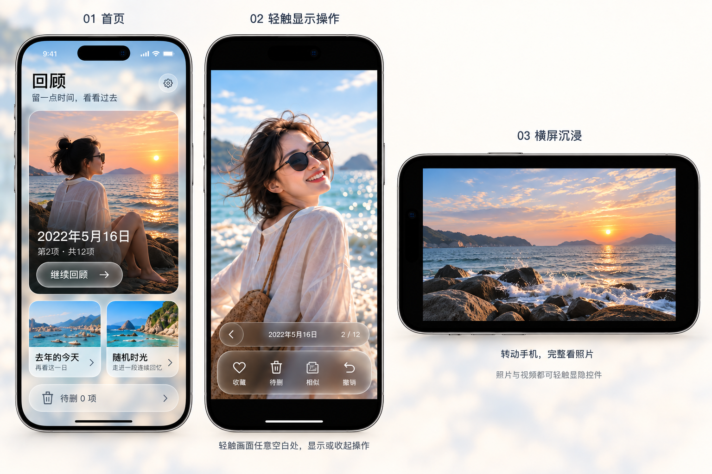

# 2026-09-28 手动验收调整

用户已确认方案及本次静态调整稿“符合，按这版实现”。

由内置 imagegen 基于 ui-approved-liquid-glass-v1.png 生成。它是视觉参考，不是实际 App 截图；示例照片、日期和计数不得写死到产品。照片浏览按原比例完整展示，不能照图裁切。旧稿保留。

## 已确认的六点

1. 恢复统一原生液态玻璃：照片氛围背景、通透控件、清晰媒体。首页、回顾、相似比较、删除复核沿用统一材质。
2. 待删为两张小卡片下方低矮横向玻璃卡片；常规字号首屏完整露出，适配安全区；辅助字号允许滚动。
3. 左滑下一项、右滑上一项正常工作，覆盖真实首页进入的浏览、视频、黑边、控件与缩放；到首尾给反馈。
4. 首页封面仅选所属片段照片；加载、离线与失败可区分，有限尝试其他候选。无照片时用有意设计的空态，不用视频代替封面、不移除回顾视频。
5. 浏览画面包括黑边全区域单击显隐底部栏；按钮/进度条优先，视频单击也显隐，播放暂停由控件负责。
6. 浏览支持左右横屏，完整比例，旋转保留资产/游标，控件适配；首页保持竖屏。

## 归属与验收

- F009：问题1/2/4，原验收未满足，重新打开。布局/封面属于同一首页截图与状态验证面；其他页面只复用统一材质，不改业务。
- F010：问题3，原翻页验收未满足，重新打开。用户实机报告为失败证据；不能用既有模拟器通过否定它，需补真实入口/视频手势覆盖。
- F019：问题5，替换旧的顶部点按/视频中部播放暂停约定，是新增需求。
- F020：问题6，独立的方向支持和布局验证，是新增需求。
- F018：真机/iCloud/性能验证保持未通过；现存改动基线见忽略目录 .build/manual-review-baseline/。本次调度暂回 todo，保留 attempts、所有证据和未完成项；不覆盖原实现。

每项 work-fast 独立交接、当前会话编码、独立 Evaluator。模拟器/受控失败与实际 iCloud 证据分开。未经本次明确提交指令不提交。

用户进一步明确第3点入口为：首页点“继续回顾”后的全屏浏览。排查与UI回归必须覆盖该实际入口，不把单图放大/待删预览误作问题对象。
